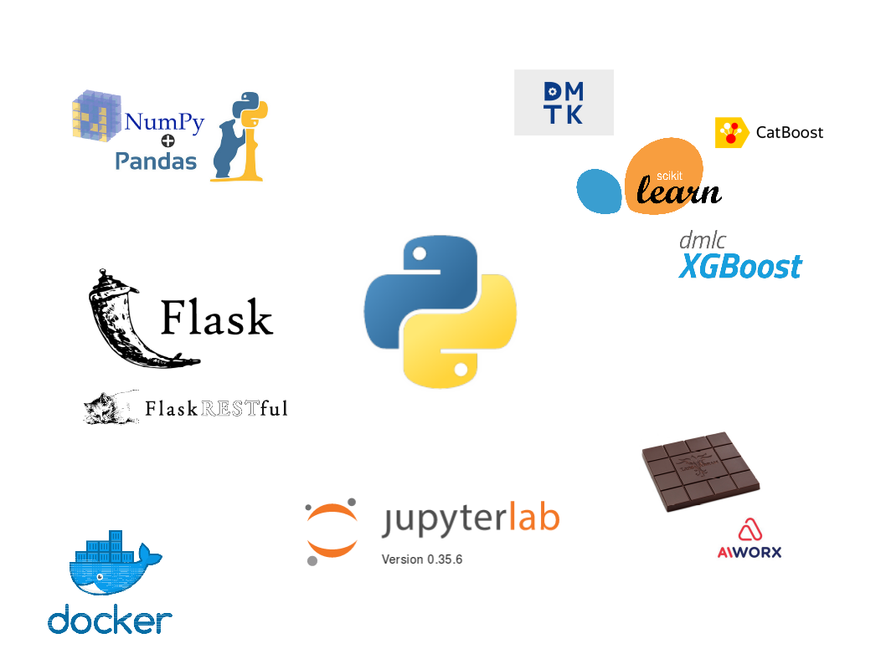
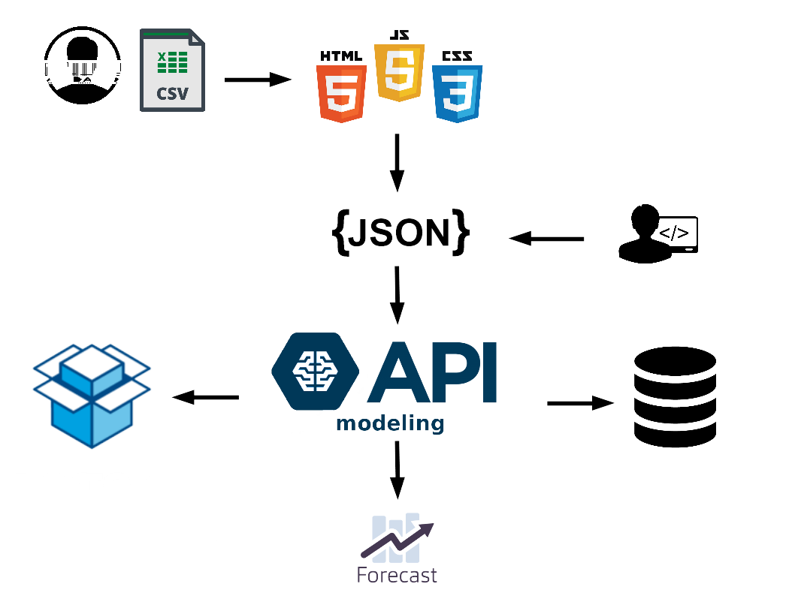

<!-- $size: 3:4 -->


Nostradamus
===
<font color="#76244C"> Sistema de previsão automatizado de séries temporais </font>

<br>

Aluno: Jayme Tolpolar Anchante
Orientador: Prof. Dr. André R. A. Grégio

<br>

<font size=4> Especialização em Data Science e Big Data </font>
<font size=4> Universidade Federal do Paraná </font>

---


# Objetivo


---


<br>

<q> <big> Criar um sistema automatizado de previsão de séries temporais </big> </q>

---


# Motivação


---


<br>

Democratizar AI: do analista de marketing ao diretor de vendas


---


&nbsp;  &nbsp;&nbsp;&nbsp;&nbsp;&nbsp;&nbsp; 
<br>

Poder preditivo: code free

---


<br><br>

Customização: dev e DS

---


# Tecnologias utilizadas

---




---


# Estrutura do projeto

---


<font size=4>
  
```
.
└── time-series-forecasting-api
    ├── app.py
    ├── controller
    │   ├── fit.py
    │   ├── predict.py
    │   ├── signup.py
    │   └── verify_email.py
    ├── Dockerfile
    ├── helpers
    │   ├── benchmark.py
    │   ├── disk.py
    │   ├── generate_fake_data.py
    │   └── spinner.py
    ├── model
    │   ├── postgresql.py
    │   └── sqlite.py
    ├── README.md
    ├── requirements.txt
    ├── run.sh
    ├── services
    │   ├── feature_engineering.py
    │   ├── hyperparameter_optimization.py
    │   ├── json_processing.py
    │   ├── modeling.py
    │   ├── pipeline.py
    │   ├── preprocessing.py
    │   └── user.py
    └── sql
        ├── ddl
        │   └── schema_main.sql
        └── dml
            ├── verify_api_key.sql
            └── verify_email.sql
```

</font>

---


# Arquitetura

---





---


# Visão do usuário


---


dados:

``` [{"y": 0.0}, {"y": 0.4967141530112327}, {"y": 0.3336141441894864}, {"y": 0.9646219750807046}, {"y": 2.4394207327346944}, {"y": 2.0832963213746236}, {"y": 1.744994548356712}] ```

<br>

requisição:

```
curl -X POST -H "Content-type: application/json"
-d@"dados.json"
"""api.<base_url>/<api_key>/forecast/?\
   steps=7&\
   freq=D&\
   num_iter=100&\
   timeout=360&\
   early_stop=20&\
   model=lr,xgb,lgbm""""
```


---


retorno:

``` {"performance": 0.7642, "forecast": [{"y": 1.123}, {"y": 0.12327}, {"y": 3.3336}, {"y": 0.19750807}, {"y": 1.2074394}, {"y": 2.08329632}, {"y": 2.344994548}]} ```

---


# Fluxo de ML

---


&nbsp;&nbsp;&nbsp;&nbsp;&nbsp;&nbsp;&nbsp;&nbsp;&nbsp;&nbsp;&nbsp;&nbsp;&nbsp;&nbsp;&nbsp;&nbsp;&nbsp;&nbsp;&nbsp;&nbsp;&nbsp;&nbsp;&nbsp;&nbsp; Dados
&nbsp;&nbsp;&nbsp;&nbsp;&nbsp;&nbsp;&nbsp;&nbsp;&nbsp;&nbsp;&nbsp;&nbsp;&nbsp;&nbsp;&nbsp;&nbsp;&nbsp;&nbsp;&nbsp;&nbsp;&nbsp;&nbsp;&nbsp;&nbsp;&nbsp;&nbsp;&nbsp; ⬇
&nbsp;&nbsp;&nbsp;&nbsp;&nbsp;&nbsp;&nbsp;&nbsp;&nbsp;&nbsp;&nbsp;&nbsp;&nbsp;&nbsp;&nbsp;&nbsp;&nbsp;&nbsp;&nbsp;&nbsp;&nbsp;&nbsp; Discovery
&nbsp;&nbsp;&nbsp;&nbsp;&nbsp;&nbsp;&nbsp;&nbsp;&nbsp;&nbsp;&nbsp;&nbsp;&nbsp;&nbsp;&nbsp;&nbsp;&nbsp;&nbsp;&nbsp;&nbsp;&nbsp;&nbsp;&nbsp;&nbsp;&nbsp;&nbsp;&nbsp; ⬇
&nbsp;&nbsp;&nbsp;&nbsp;&nbsp;&nbsp;&nbsp;&nbsp;&nbsp;&nbsp;&nbsp;&nbsp;&nbsp;&nbsp;&nbsp; Pré-processamento 
&nbsp;&nbsp;&nbsp;&nbsp;&nbsp;&nbsp;&nbsp;&nbsp;&nbsp;&nbsp;&nbsp;&nbsp;&nbsp;&nbsp;&nbsp;&nbsp;&nbsp;&nbsp;&nbsp;&nbsp;&nbsp;&nbsp;&nbsp;&nbsp;&nbsp;&nbsp;&nbsp; ⬇
&nbsp;&nbsp;&nbsp;&nbsp;&nbsp;&nbsp;&nbsp;&nbsp; Engenharia de características
&nbsp;&nbsp;&nbsp;&nbsp;&nbsp;&nbsp;&nbsp;&nbsp;&nbsp;&nbsp;&nbsp;&nbsp;&nbsp;&nbsp;&nbsp;&nbsp;&nbsp;&nbsp;&nbsp;&nbsp;&nbsp;&nbsp;&nbsp;&nbsp;&nbsp;&nbsp;&nbsp; ⬇
&nbsp;&nbsp;&nbsp;&nbsp;&nbsp;&nbsp;&nbsp;&nbsp;&nbsp;&nbsp;&nbsp;&nbsp;&nbsp;&nbsp;&nbsp;&nbsp;&nbsp;&nbsp;&nbsp;&nbsp; Modelagem
&nbsp;&nbsp;&nbsp;&nbsp;&nbsp;&nbsp;&nbsp;&nbsp;&nbsp;&nbsp;&nbsp;&nbsp;&nbsp;&nbsp;&nbsp;&nbsp;&nbsp;&nbsp;&nbsp;&nbsp;&nbsp;&nbsp;&nbsp;&nbsp;&nbsp;&nbsp;&nbsp; ⬇
&nbsp; Resultados, validações e explicações

---


# Fluxo automatizado de ML

---


&nbsp;&nbsp;&nbsp;&nbsp;&nbsp;&nbsp;&nbsp;&nbsp;&nbsp;&nbsp;&nbsp;&nbsp;&nbsp;&nbsp;&nbsp;&nbsp;&nbsp;&nbsp;&nbsp;&nbsp;&nbsp;&nbsp;&nbsp;&nbsp; Dados
&nbsp;&nbsp;&nbsp;&nbsp;&nbsp;&nbsp;&nbsp;&nbsp;&nbsp;&nbsp;&nbsp;&nbsp;&nbsp;&nbsp;&nbsp;&nbsp;&nbsp;&nbsp;&nbsp;&nbsp;&nbsp;&nbsp;&nbsp;&nbsp;&nbsp;&nbsp;&nbsp; ⬇
&nbsp;&nbsp;&nbsp;&nbsp;&nbsp;&nbsp;&nbsp;&nbsp;&nbsp;&nbsp;&nbsp;&nbsp;&nbsp;&nbsp;&nbsp;&nbsp;&nbsp;&nbsp;&nbsp;&nbsp;&nbsp;&nbsp; Discovery
&nbsp;&nbsp;&nbsp;&nbsp;&nbsp;&nbsp;&nbsp;&nbsp;&nbsp;&nbsp;&nbsp;&nbsp;&nbsp;&nbsp;&nbsp;&nbsp;&nbsp;&nbsp;&nbsp;&nbsp;&nbsp;&nbsp;&nbsp;&nbsp;&nbsp;&nbsp;&nbsp; ⬇
&nbsp;&nbsp;&nbsp;&nbsp;&nbsp;&nbsp;&nbsp;&nbsp;&nbsp;&nbsp;&nbsp; Pré-processamento <small> --------------- {$\mu$,interp & log,padrão,MinMax} </small>
&nbsp;&nbsp;&nbsp;&nbsp;&nbsp;&nbsp;&nbsp;&nbsp;&nbsp;&nbsp;&nbsp;&nbsp;&nbsp;&nbsp;&nbsp;&nbsp;&nbsp;&nbsp;&nbsp;&nbsp;&nbsp;&nbsp;&nbsp;&nbsp;&nbsp;&nbsp;&nbsp; ⬇
&nbsp;&nbsp;&nbsp;&nbsp;&nbsp;&nbsp;&nbsp;&nbsp; Engenharia de características <small> -- {$1,...,p$} </small>
&nbsp;&nbsp;&nbsp;&nbsp;&nbsp;&nbsp;&nbsp;&nbsp;&nbsp;&nbsp;&nbsp;&nbsp;&nbsp;&nbsp;&nbsp;&nbsp;&nbsp;&nbsp;&nbsp;&nbsp;&nbsp;&nbsp;&nbsp;&nbsp;&nbsp;&nbsp;&nbsp; ⬇
&nbsp;&nbsp;&nbsp;&nbsp;&nbsp;&nbsp;&nbsp;&nbsp;&nbsp;&nbsp;&nbsp;&nbsp;&nbsp;&nbsp;&nbsp;&nbsp;&nbsp;&nbsp;&nbsp;&nbsp; Modelagem <small> ------------------ { $algoritmo {parâmetros}$ } </small>
&nbsp;&nbsp;&nbsp;&nbsp;&nbsp;&nbsp;&nbsp;&nbsp;&nbsp;&nbsp;&nbsp;&nbsp;&nbsp;&nbsp;&nbsp;&nbsp;&nbsp;&nbsp;&nbsp;&nbsp;&nbsp;&nbsp;&nbsp;&nbsp;&nbsp;&nbsp;&nbsp; ⬇
&nbsp; Resultados, validações e explicações

---


# Otimização


---


```
             Features: parâmetros amostrados

             Alvo: erro
```

<br>

Algoritmo Bayesiano &nbsp;


---


# Resultados preliminares

---


### Bases de dados
<br>

* Sunspots: número anual de manchas solares entre 1700 e 2008
* Airpassengers: número mensal de passageiros do vôos
* Austres: número trimestral de dados residenciais
* Heartrate: batimentos cardíacos
* Lynx: número anual de linces aprisionados entre 1821-1934 no Canadá
* Wineind: venda de vinhos anual no Canadá
* Woolyrnq: produção trimestral de fios de lã na Austrália

---


### Erro absoluto médio
<br>

|    dataset     |   arima   |   prophet   |   nostradamus   |
|----------------|-----------|-------------|-----------------|
|    sunspots    |   42.53   |    47.03    |      40.42   *  |
| airpassengers  |   55.18 * |    55.81    |     105.25      |
|    austres     |  215.41   |    48.29  * |    2599.92      |
|   heartrate    |    7.87   |     9.18    |       6.79   *  |
|     lynx       | 1133.79 * |  1240.41    |    1521.27      |
|    wineind     | 4225.75   |  4252.09    |    3729.05   *  |
|    woolyrnq    |  678.70 * |   810.89    |     847.96      |


---


### ranking

<br>

1º lugar arima (3) e nostradamus (3)
2º lugar prophet (1)

---

# Obrigado